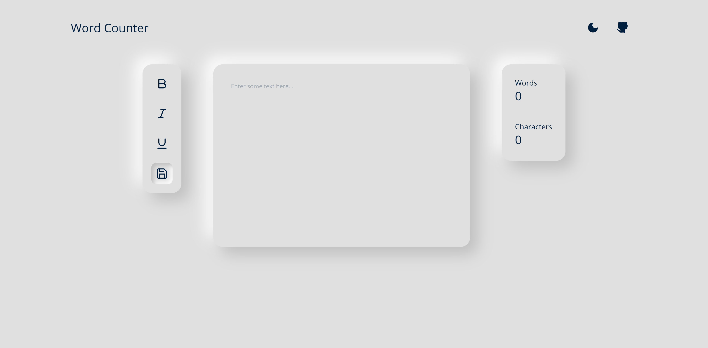
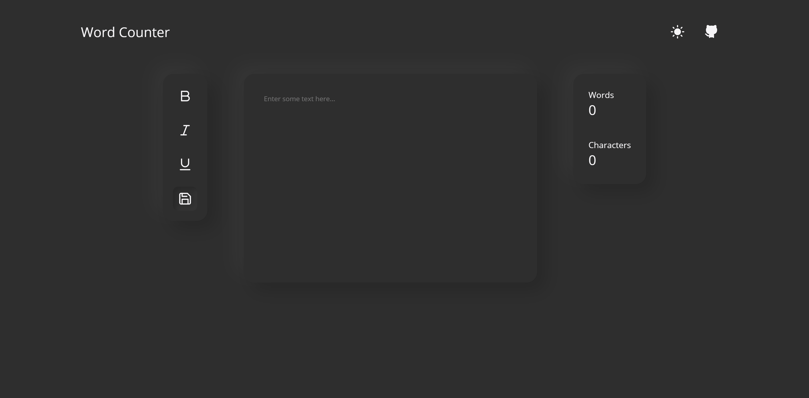

# Word Counter

Simple text editor with word and character count made with React, Slate.js, and styled-components.

Check it out at [wordcounter.alexyu.ca](https://wordcounter.alexyu.ca)

## Features

- Word and character count
- Toggle bold, italic, underline
- Autosave
- Neumorphic design with light and dark mode

## Usage

### `npm install` 

Installs all the necessary dependencies for the project.

### `npm start`

Runs the app in development mode at http://localhost:8080/.

### `npm run build`

Builds the app for production to the `dist` folder.

## Note

Slate is not currently supported on Android.